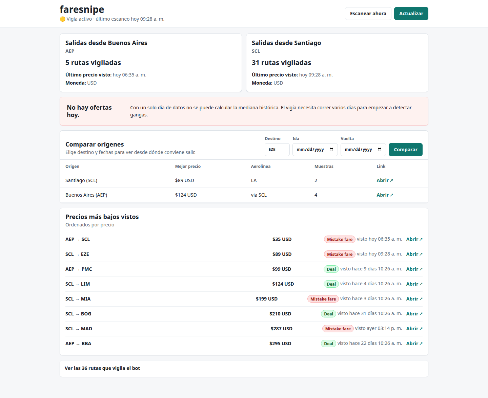
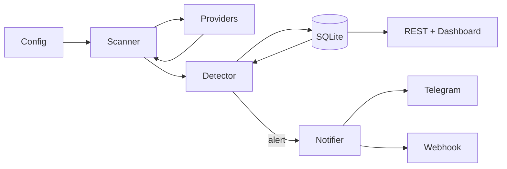

# faresnipe

[](LICENSE)
[](pyproject.toml)
[](https://github.com/010zx00x1/faresnipe/actions)

> ✈  Open-source mistake fare hunter. Snipe cheap flights before airlines fix them.



## Why

Mistake fares disappear in minutes. Paid services like Going.com charge $60/yr to alert you. This is the open alternative: it runs on your machine, keeps your data local, and is fully auditable code.

## Install

```bash
pip install faresnipe
faresnipe init --from YOUR_AIRPORT --to EZE,MAD,YYZ
faresnipe run
faresnipe serve
```

That's it. No API key. No account. The whole detector is 67 lines and you can read it.

### Web API
Run `uvicorn faresnipe.api:app --port 8000` and curl `http://127.0.0.1:8000/api/SCL/EZE/2026-08-15`.

## What it caught

Last 24h: SCL->EZE $89 (-78%), SCL->MAD $287 (-73%).

## How it works

faresnipe runs in three layers: **scanner**, **detector**, and **storage**. They talk to each other through a local SQLite database; nothing leaves your machine unless you wire a notifier.

1. **Scanner** (`src/faresnipe/scanner.py`). Reads the routes from your TOML config and asks one or more providers for a quote for each `(origin, destination, departure_date, stay_length)` tuple. Providers translate that into a real call to Google Flights, Skyscanner, or a mock source and return a normalized `FareQuote` (price, currency, carrier, booking URL, observed_at).
2. **Detector** (`src/faresnipe/detector.py`, ~65 lines). For each new quote, it looks up the historical median for the same `(origin, destination, stay_length)` bucket from SQLite and applies the four rules from [Detection rules](#detection-rules). It then writes the quote and any alert back to SQLite.
3. **Storage** (`src/faresnipe/storage.py`). A single SQLite file. Holds every quote you ever collected, computes the rolling median per bucket, and is the source of truth for the dashboard and the REST API.

The `faresnipe run` CLI wraps the scanner in a loop. The dashboard and the REST API only read SQLite, so they're safe to expose on your LAN while scanning continues in the background.

## Architecture

faresnipe is a small loop: the scanner asks providers for quotes, the
detector compares them against the historical median in SQLite, and any
alert goes out to the notifier.



The four rules are cumulative: a fare can start as a `deal` and be promoted
to `mistake_fare` if it also clears a stricter threshold. See
[Detection rules](#detection-rules) for the full table.

## Stack

**Runtime**
- Python 3.11+ (tested on 3.11 and 3.12)
- SQLite (stdlib, no server)
- Docker image: `python:3.11-slim`

**Core libraries**
- [FastAPI](https://fastapi.tiangolo.com/) - REST API + dashboard server
- [uvicorn](https://www.uvicorn.org/) - ASGI server
- [scrapling](https://github.com/D4Vinci/Scrapling) - resilient scraping for the experimental Google Flights provider
- [fast-flights](https://github.com/AWeirdDev/flights) - fast Google Flights lookup for the structured provider
- [typing_extensions](https://github.com/python/typing_extensions) - modern typing on 3.11

**Frontend (dashboard)**
- No JS framework. Plain HTML + CSS + ~400 lines of vanilla JS in `src/faresnipe/dashboard/static/`. Keeps the install footprint tiny and the build step zero.

**Optional / notifiers**
- `playwright` (install with `pip install 'faresnipe[scraping]'`) for the experimental scrapers
- Telegram bot for push alerts (env: `FARESNIPE_TELEGRAM_BOT_TOKEN`, `FARESNIPE_TELEGRAM_CHAT_ID`)

**Tooling**
- `unittest` (stdlib) for tests, 58 cases across providers, scanner, detector, storage, API, CLI, and dashboard
- `ruff` for linting
- `python -m build` + `twine` for package checks
- GitHub Actions: CI on push/PR (Python 3.11 + 3.12), Docker image on tag push

## Detection rules

| Rule | Trigger | Severity |
|---|---|---|
| 1 | price <= max_price | deal |
| 2 | price <= mistake_fare_below | mistake_fare |
| 3 | discount >= discount_ratio vs median | deal |
| 4 | discount >= mistake_fare_ratio vs median | mistake_fare |

Rules are cumulative: a fare can start as a deal and become `mistake_fare` if it also clears a stricter threshold.

## Providers

| Provider | Status | Notes |
|---|---|---|
| `mock` | stable | Deterministic fixture data; used by tests and the demo seed. |
| `google_flights_structured` | stable | Primary provider. Uses `fast-flights` to read Google Flights prices for the routes you configure. No scraping. |
| `skyscanner` | stable | Optional Skyscanner integration. Requires `SKYSCANNER_API_KEY` in env. |
| `experimental/google_flights_scrapling` | experimental | Browser-based scraper using Scrapling + Playwright. Slower, more resilient to layout changes. |
| `experimental/flight_finder_scraper` | experimental | Flight Finder-style scraper. Early stage, use with `--limit`. |

Experimental providers live under `src/faresnipe/providers/experimental/` and are excluded from the stable release train. Pin a working one with `provider = "google_flights_structured"` in your config.

## Compared to

|              | faresnipe | Going.com | Hopper   |
|--------------|-----------|-----------|----------|
| Price        | Free, MIT | $60/yr    | Free + ads |
| Data         | Your box  | Theirs    | Theirs   |
| Open source  | Yes       | No        | No       |
| Mistake fare | Yes       | Yes       | No       |
| Self-hosted  | Yes       | No        | No       |
| Auditable    | Yes       | No        | No       |
| API/webhook  | Yes       | No        | No       |

## What it doesn't do

- Not a booking engine. It alerts; you book.
- Doesn't store payment info.
- Doesn't require a Google account.
- Doesn't track you.

## Commands

`faresnipe init` creates `config/faresnipe.toml` from the example, optionally scoped with `--from SCL`.

`faresnipe run` runs one scan; add `--watch` for continuous scanning and `--limit` while testing.

`faresnipe serve` starts the local dashboard on `127.0.0.1:8765` by default.

## Development

```bash
python -m venv .venv
.venv/bin/pip install -e '.[dev,scraping]'

# Run tests (58 cases)
.venv/bin/python -m unittest discover -s tests -v

# Lint
.venv/bin/ruff check src/ tests/

# Try the dashboard against demo data
.venv/bin/python scripts/dev/seed_demo_db.py
.venv/bin/faresnipe serve --port 8765
# open http://127.0.0.1:8765

# Build the package
.venv/bin/python -m build
.venv/bin/twine check dist/*
```

## Contributing

- Open an issue to add a new route
- New providers go in `src/faresnipe/providers/experimental/`
- PRs welcome

## License

MIT
